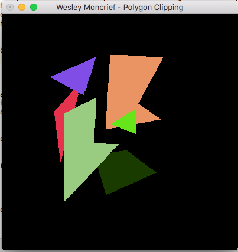
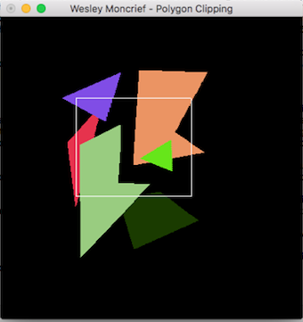

# Polygon Scan Line Conversion & Sutherland–Hodgman Clipping

In this project, I let the user draw polygons by giving input with the mouse. The
polygons were drawn using the [Scanline Conversion Algorithm](https://en.wikipedia.org/wiki/Scanline_rendering), which
iterates through each row of pixels on the screen in a highly efficient manner to
draw arbitrary polygons.

After the polygons are created, I used the [Sutherland-Hodgman Clipping Algorithm](https://en.wikipedia.org/wiki/Sutherland%E2%80%93Hodgman_algorithm) to
efficiently clip each polygon to match the user-inputted clipping window.

Below are all of the polygons drawn according to user input.

The following shows the clipping window that the user selected.

The following shows the screen after the polygons were
clipped with Sutherland-Hodgman.

